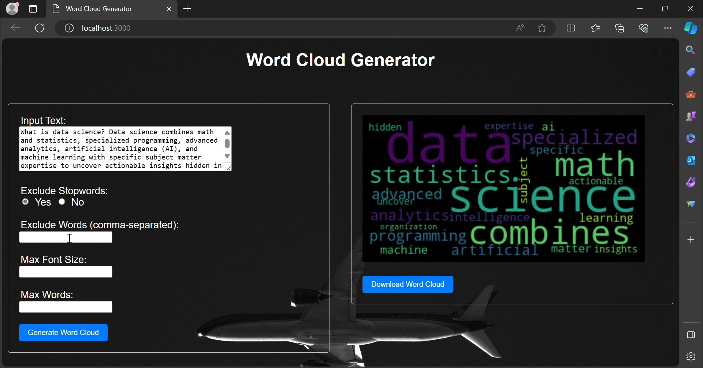

# WordCloud Generator App



## Description

This application is a WordCloud generator that allows users to create visually appealing representations of text data. The generated WordClouds are downloadable, providing an easy way to visualize word frequency and prominence within the provided text.

## Features

- **Text Input**: Enter your text data to create a word cloud.
- **Stopword Exclusion**: Exclude common stopwords from the word cloud.
- **Word Exclusion**: Choose specific words to exclude.
- **Font Size Adjustment**: Customize the font size style used in the word cloud.
- **Word Count Selection**: Set the number of words to display in the word cloud.


## Docker Image

This repository contains the Dockerfile and configurations to build and run the Word Cloud Generator app. Use the following steps to get started:

### Docker Installation

Install Docker by following the instructions [here](https://docs.docker.com/get-docker/).

### Build and Run

Clone this repository and navigate to the directory:

```bash
  git clone https://github.com/mondaldebojit21/word-cloud-generator.git
  cd word-cloud-generator
```

Build the Docker image:

```bash
  docker build -t word-cloud-app .
```

Run the Docker container:

```bash
  docker run -d -p 3000:3000 word-cloud-app
```

Access the app by visiting [http://localhost:3000](http://localhost:3000) in your web browser.
